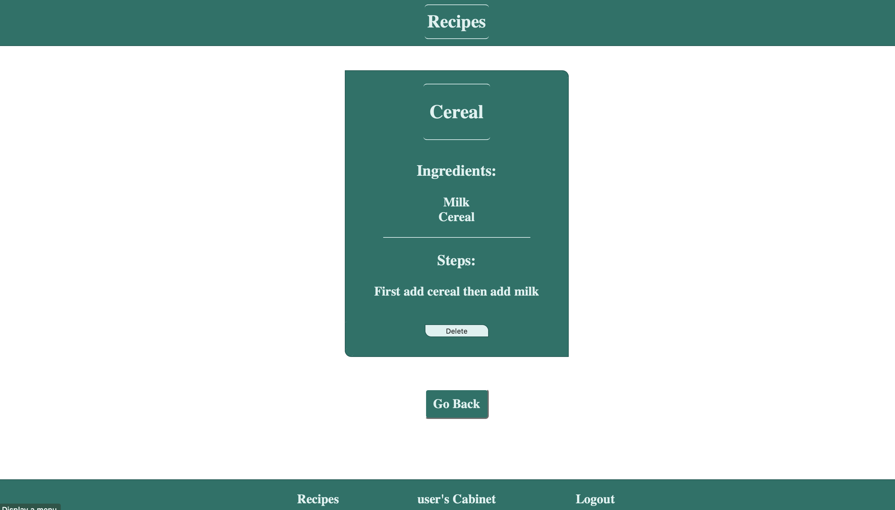

# Recipe Server

This is the server used for the Recipe application.

[Link](https://github.com/SeyiAriyo/capstone-server) to Recipe Application GitHub

## API Endpoints

+ `/recipes` accepts GET requests along with parameters of keyword & filter, where keyword looks in the recipe name, and filter looks for the spirit category. Both need to be strings.
+ `/cabinet/:id` accepts GET and POST requests, with `:id` referring to the user_id. GET requests return all the spirits that the user has saved, and the POST request is used to add an ingredient to the users collection.

```js
// req.body
{
    ingredient_name: String,
    ingredient_id: int,
    user_id: int,
}	
```

+ `/favorites` accepts POST and DELETE requests. This posts and deletes new favorites, the user_id is sent via the body of the request.
```js
// req.body
{  
    user_id: int,
    recipe_id: int,
}	
```

+ `/favorites/:id` accepts GET requests, where `:id` is the user_id. This is used to get all the favorites of that particular user.

## Scripts

+ Start the application `npm start`

+ Start nodemon for the application `npm run dev`

+ Run the tests `npm test`

+ Migrate the Tables into database ` npm run migrate ` or ` npm run migrate:test `

+ Seed Tables with data after migration `npm run seed`

## Deployment

This Server is deployed with Heroku at `https://vast-plains-52676.herokuapp.com`.

# Recipes

[Live](https://capstone-client.seyiariyo.vercel.app)

## DEMO Account

Username: user66
password: 12345678aA

## Summary

The recipe app is a personal cooking assistant. You can add your favorite and current ingredients in your liquor cabinet to your digital cabinet, and the app will show you what recipes you can make with your ingredients and how! You will also be able to search for recipes by ingredient type and make a shortlist of your favorite ones to try later.

### Your Cabinet

Once Logged in you'll be sent your Cabinet, this is where you'll add and store your ingredients. From here you can access your entire favorite recipes list, as well as a shortlist below where it shows you which favorites you can make based off of the ingredients currently in your cabinet.


### Searching for Recipes

Once you add some ingredients to your cabinet it's time to look for some recipes to make! The recipes page can search by name of recipe, or ingredient type, displaying all the recipes in the database that fit the parameters.


After finding a recipe you would like, you can follow the instructions to make i, or save it to your favorites to make later



### Viewing Favorites

If there is a recipe that you enjoyed, and want to make it more often, then save it to your favorites. The app will remind you that you can make it when you have the main ingredient in your cabinet. To take a look at all of your favorites there is a link towards the top of the Cabinet that leads you to the favorites page. Within the favorites page you can search through your favorites wtih the same parameters you used to serach for other recipes, by ingredient or name.


### Recording your own Recipes

If you're interested in making some recipes of your own and want a place to keep them, you can view and add your own custom recipes. Just type in the name, ingredients, recipe type, and preperation instructions and it will be saved to our database for you to view anytime.


## Technology Used

- React
- Express
- CSS3
- Javascript
- Node
- PostgreSQL

## API

[Link](https://github.com/SeyiAriyo/capstone-server) to API GitHub